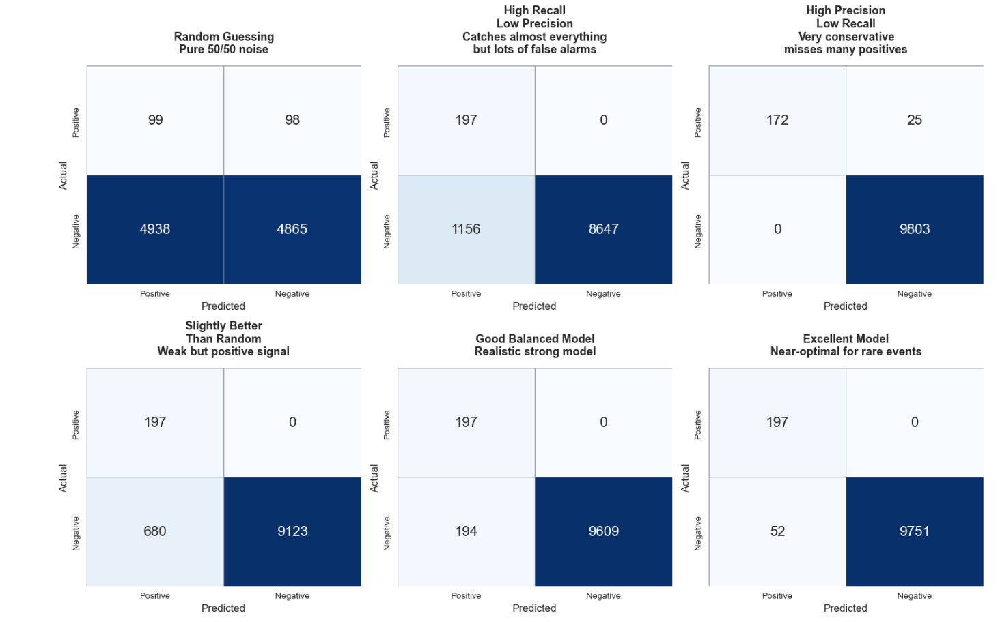
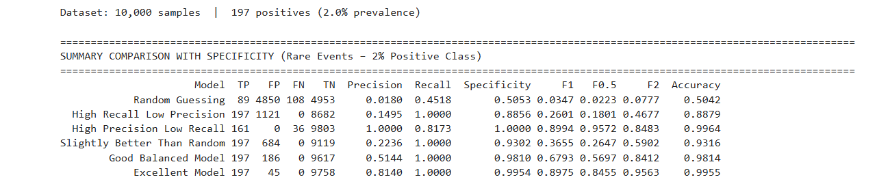

# Evaluation Metrics: Confusion Matrix, Precision, Recall, F-score & More

## 1. Confusion Matrix (Binary Classification)

|                  | Predicted Positive | Predicted Negative |
|------------------|--------------------|--------------------|
| **Actual Positive** | True Positive (TP) | False Negative (FN) |
| **Actual Negative** | False Positive (FP) | True Negative (TN)  |

- **TP**: Correctly predicted positive  
- **FN**: Missed positive (Type II error)  
- **FP**: False alarm (Type I error)  
- **TN**: Correctly predicted negative  

## 2. Key Metrics Derived from the Confusion Matrix

| Metric                  | Formula                                      | Interpretation                                                    | Range | Best |
|-------------------------|----------------------------------------------|-------------------------------------------------------------------|-------|------|
| Accuracy                | (TP + TN) / (TP + TN + FP + FN)              | Overall correctness                                               | 0–1   | 1    |
| Precision               | TP / (TP + FP)                               | Of all predicted positives, how many are truly positive?         | 0–1   | 1    |
| Recall (Sensitivity)    | TP / (TP + FN)                               | Of all actual positives, how many did we catch?                   | 0–1   | 1    |
| Specificity             | TN / (TN + FP)                               | Of all actual negatives, how many correctly identified?          | 0–1   | 1    |
| F1-score                | 2 × (Precision × Recall) / (Precision + Recall) | Harmonic mean of precision and recall                          | 0–1   | 1    |
| Fβ-score                | (1 + β²) × (Precision × Recall) / (β² × Precision + Recall) | Generalization; β > 1 favors recall, β < 1 favors precision | 0–1   | 1    |

## 3. Practical Example – Imbalanced Dataset  
(1000 samples, only 50 true positives → 5% prevalence)

| Model | TP | FP  | FN | TN  | Accuracy | Precision | Recall | F1-score | F2-score |
|-------|----|-----|----|-----|----------|-----------|--------|----------|----------|
| A     | 40 | 10  | 10 | 940 | **98.0%**    | 0.800     | 0.800  | **0.800**    | 0.800    |
| B     | 45 | 100 | 5  | 850 | 89.5%    | 0.310     | 0.900  | 0.462    | **0.632**    |

### Observations
- **Accuracy** is misleadingly high for both (due to class imbalance).
- Model A is balanced → **F1 strongly prefers A**.
- Model B catches more true positives but raises many false alarms → precision collapses.
- **F1 punishes low precision harshly** because it uses the harmonic mean.

## 4. When to Use Which Metric?

| Scenario                                    | Best Metric(s)                     | Why?                                                                 |
|---------------------------------------------|------------------------------------|----------------------------------------------------------------------|
| Balanced classes                            | Accuracy, F1                       | Simple and intuitive                                                 |
| Highly imbalanced classes                   | F1, PR-AUC, Recall                 | Accuracy is dominated by the majority class                          |
| Missing a positive is extremely costly (e.g., cancer, fraud) | Recall, F2 (or higher β) | You can tolerate false positives but not false negatives            |
| False positives are very expensive (e.g., spam filter) | Precision, F0.5                  | You want almost no false alarms                                      |
| You need a single balanced number           | F1                                 | Harmonic mean prevents one metric from dominating                    |

## 5. Fβ-score Interpretation

$$
F_\beta = (1 + \beta^2) \frac{\text{Precision} \times \text{Recall}}{\beta^2 \cdot \text{Precision} + \text{Recall}}
$$

| β value | Emphasis                                  | Typical Use Case                              |
|---------|-------------------------------------------|-----------------------------------------------|
| 0.5     | Precision ≈ 2× more important than recall | Spam detection, search engines                |
| 1       | Precision and recall equally important    | General-purpose (most common)                 |
| 2       | Recall ≈ 2× more important than precision | Disease screening, fraud/anomaly detection    |

## 6. Precision-Recall vs ROC Curves (Imbalanced Data)

| Curve               | X-axis              | Y-axis     | Better for Imbalanced Data? | Baseline |
|---------------------|---------------------|------------|-----------------------------|----------|
| Precision-Recall    | Recall              | Precision  | Yes                         | Prevalence |
| ROC                 | False Positive Rate | TPR (Recall) | No (can be overly optimistic) | 0.5    |

**Recommendation:** Use **PR curve & PR-AUC** when positive class is rare (<10%).

## Summary

- Always start with the **confusion matrix**.
- Never rely only on **accuracy** in imbalanced settings.
- **F1** is great when you want balance and hate extreme trade-offs.
- Adjust **β** in Fβ when business costs clearly favor recall or precision.
- Choose metrics that align with the real-world cost of errors in your problem.

- # Example
- 
- ## Summary
- 
